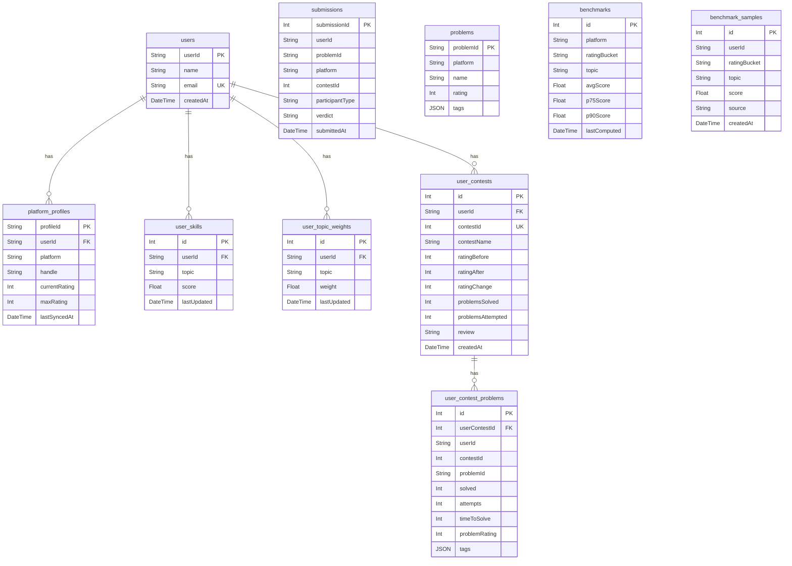

# CP_Agent — Project Structure & Architecture Guide

> **Purpose**: A competitive programming analyzer and recommendation system that ingests a user's Codeforces data, computes per-topic skill scores, compares them against peer benchmarks, and recommends problems to improve weaknesses.

---

## Directory Tree

```
CP_Agent/
├── README.md                         # Brief project description
├── PROJECT_STRUCTURE.md              # ← This file
│
└── backend/                          # All application code lives here
    ├── main.py                       # FastAPI entry point
    ├── database.py                   # SQLAlchemy engine, session, Base
    ├── models.py                     # Pydantic request/response models + SQLAlchemy ORM models
    ├── requirements.txt              # Python dependencies
    ├── seed_benchmarks.py            # Legacy seeding script (top-level, uses elite handles)
    │
    ├── routers/
    │   └── users.py                  # All API endpoints (7 routes)
    │
    ├── services/                     # Core business logic (each file = one responsibility)
    │   ├── __init__.py               # Empty (makes it a Python package)
    │   ├── codeforces.py             # HTTP client for Codeforces API (with TTL-cached contest list)
    │   ├── sync.py                   # Ingestion engine — submissions + contest history sync
    │   ├── compute_skill.py          # Skill vector calculator (weighted scoring formula)
    │   ├── benchmarks.py             # Aggregates benchmark_samples → benchmark statistics
    │   ├── analytics.py              # Compares user skill vs. peer-bucket benchmark
    │   ├── gap_analysis.py           # Compares user skill vs. elite benchmark
    │   ├── recommendations.py        # Suggests unsolved problems for weakest topic
    │   ├── topic_weights.py          # Initializes per-user topic weights (default 1.0)
    │   └── topic_learning.py         # Adjusts topic weights after contests (reinforcement learning)
    │
    ├── scripts/                      # One-off CLI scripts (run manually)
    │   ├── generate_seed_handles.py  # Fetches rated CF users, samples 40 per bucket → JSON
    │   ├── seed_benchmarks.py        # Iterates seed handles, syncs data, writes benchmark_samples
    │   └── build_benchmarks.py       # Converts benchmark_samples → final benchmark stats
    │
    └── benchmark_seed/               # Pre-generated JSON files of Codeforces handles per rating bucket
        ├── 800_999.json
        ├── 1000_1199.json
        ├── 1200_1399.json
        ├── 1400_1599.json
        ├── 1600_1799.json
        ├── 1800_1999.json
        ├── 2000_2199.json
        └── 2200_plus.json            # Empty (no handles generated for 2200+)
```

---

## Tech Stack

| Layer       | Technology                  |
|-------------|-----------------------------|
| Framework   | **FastAPI** (async Python)  |
| ORM         | **SQLAlchemy** (declarative)|
| Database    | **SQLite** (`cp_agent.db`)  |
| HTTP Client | **httpx** (async, with retry) |
| Validation  | **Pydantic** (request/response models) |
| Math        | **numpy** (percentile calculations) |

---

## Database Schema (9 tables)



---

## API Endpoints

All routes are defined in `routers/users.py` and mounted on the root path.

| # | Method | Path | Purpose | Service Called |
|---|--------|------|---------|---------------|
| 1 | `POST` | `/users` | Create a new user | Direct DB insert |
| 2 | `POST` | `/users/{user_id}/platform` | Link a Codeforces handle (verifies via API) | `codeforces.fetch_user_info` |
| 3 | `GET`  | `/users/{handle}/submissions-preview` | Preview raw CF submissions (no DB save) | `codeforces.fetch_user_submissions` |
| 4 | `POST` | `/users/{user_id}/sync` | Sync CF submissions + contest history | `sync.sync_codeforces_data` + `sync.sync_contest_history` + `topic_weights.initialize_user_topic_weights` |
| 5 | `GET`  | `/users/{user_id}/skill` | Compute & return skill vector | `compute_skill.compute_user_vector` |
| 6 | `GET`  | `/users/{user_id}/evaluate` | Compare user to peer-bucket benchmark | `analytics.compare_user_to_benchmark` |
| 7 | `GET`  | `/users/{user_id}/report` | Compare user to elite (2000-4000) benchmark | `gap_analysis.get_performance_report` |
| 8 | `GET`  | `/users/{user_id}/recommendations` | Get 3 problem recommendations for weakest topic | `recommendations.get_problem_recommendations` |

---

## Core Data Flow

```
┌─────────────────────────────────────────────────────────────────┐
│                        USER JOURNEY                             │
│                                                                 │
│  1. POST /users                Create account                   │
│  2. POST /users/{id}/platform  Link CF handle (verified)        │
│  3. POST /users/{id}/sync      Ingest all submissions           │
│  4. GET  /users/{id}/skill     See per-topic scores             │
│  5. GET  /users/{id}/evaluate  Compare vs. peers                │
│  6. GET  /users/{id}/report    Compare vs. elite                │
│  7. GET  /users/{id}/recommendations  Get practice problems     │
└─────────────────────────────────────────────────────────────────┘
```

### Step-by-step internal flow for `/sync`:

```
Codeforces API  ──(httpx)──►  codeforces.py  ──(raw JSON)──►  sync.py
                                                                │
    ┌───────────────────────────────────────────────────────────┘
    │  Phase 1: sync_codeforces_data()
    │  1. Fetch all submissions via user.status API
    │  2. Load existing submission IDs from DB (O(1) set lookup)
    │  3. Skip already-stored submissions (incremental update)
    │  4. Convert new submissions → DBSubmission + DBProblem objects
    │  5. db.merge() problems (upsert), db.add_all() submissions
    │  6. Update lastSyncedAt on platform_profiles
    │  7. Single db.commit()
    │
    │  Phase 2: sync_contest_history()
    │  1. Fetch rating changes via user.rating API
    │  2. Fetch contest start times via contest.list API (24h TTL cache)
    │  3. Pre-compute unsynced contest IDs, early-return if none
    │  4. Batch-fetch submissions for unsynced contests only (single query)
    │  5. Group by contestId in memory, aggregate per-problem stats
    │  6. Create DBUserContest + DBUserContestProblem rows
    │  7. Compute timeToSolve using official contest start times
    │  8. db.commit() wrapped in IntegrityError handler
    └──►  DB now has full submission + problem + contest history
```

### Step-by-step internal flow for `/skill`:

```
compute_skill.py
  │
  │  1. JOIN submissions × problems for the user
  │  2. Group by problemId, track attempt count + first AC
  │  3. For each solved problem, calculate:
  │       score = difficulty_weight × recency_weight × attempt_penalty
  │       • difficulty_weight = (rating/1000)² × 20
  │       • recency_weight   = e^(-0.05 × months_ago)
  │       • attempt_penalty   = 1.0 → 0.6 based on attempts until first AC
  │  4. Split score equally across all problem tags
  │  5. Apply diminishing returns: sort desc, multiply by 0.9^i
  │  6. Save to user_skills table, return sorted skill vector
```

---

## Benchmark System

The benchmark system establishes "what's normal" for each rating bracket. It has a **3-phase pipeline** run via CLI scripts:

### Phase 1 — Generate Seed Handles

**Script**: `scripts/generate_seed_handles.py`

- Calls `codeforces.com/api/user.ratedList` to get all rated users
- Randomly samples **40 handles per rating bucket** (800-999, 1000-1199, … 2000-2199)
- Saves to `benchmark_seed/{low}_{high}.json`
- **Run once** — output is committed to repo

### Phase 2 — Seed Benchmark Samples

**Script**: `scripts/seed_benchmarks.py`

- Iterates each JSON file in `benchmark_seed/`
- For each handle: syncs CF submissions → computes skill vector → writes per-topic scores to `benchmark_samples` table
- Skips already-seeded handles (idempotent)
- Uses `user_id = "seed_{handle}"` to avoid collision with real users

### Phase 3 — Compute Benchmark Statistics

**Script**: `scripts/build_benchmarks.py`

- Reads all `benchmark_samples`
- Groups by `(ratingBucket, topic)`
- Calculates `avg`, `p75` (75th percentile), `p90` (90th percentile) using numpy
- Writes to `benchmarks` table (clears old stats first)

### Legacy Seeder

**Script**: `seed_benchmarks.py` (top-level in backend/)

- Uses a hardcoded list of 15 elite handles (tourist, Benq, Petr, etc.)
- Creates dummy users, syncs, computes skills
- Stores benchmark for bucket `"2000-4000"` — used by the `/report` (gap analysis) endpoint

---

## Topic Weight Learning (Reinforcement Learning)

The system adapts recommendations using a simple RL-like weight update mechanism:

### Initialization (`topic_weights.py`)

- Called after first sync
- Creates one `DBUserTopicWeight` row per benchmark topic, all initialized to **weight = 1.0**

### Update After Contest (`topic_learning.py`)

- Called with `(user_id, contest_id, rating_change)`
- `reward = rating_change / 100`
- **If rating went UP**: increases weight of topics in solved problems
- **If rating went DOWN**: increases weight of topics in unsolved (attempted but failed) problems
- Update: `weight += LEARNING_RATE(0.2) × reward`

### Usage in Recommendations (`recommendations.py`)

- For each topic: `priority = gap × weight`
- The topic with highest priority is selected as the focus
- 3 unsolved problems matching that topic (within `rating` to `rating+300`) are returned

---

## Key Design Decisions

1. **Incremental Sync**: Submissions already in DB are skipped via set-based lookup — avoids re-processing on repeated syncs.
2. **Upsert for Problems**: `db.merge()` handles the case where the same problem appears in multiple submissions.
3. **Diminishing Returns**: Guarantees that mass-solving easy problems in one topic doesn't inflate scores disproportionately — each additional solve contributes 90% of the previous.
4. **Recency Decay**: Exponential decay (`e^(-0.05 × months)`) ensures recent performance is weighted higher.
5. **Dual Benchmark Modes**: "Evaluate" compares against same-rating peers; "Report" compares against elite (GM/Masters) — serves different goals.
6. **Score Splitting by Tags**: A problem tagged `["dp", "math"]` contributes half its score to each topic — prevents multi-tag problems from inflating one topic.
7. **Contest Start Time Caching**: `fetch_contest_list()` caches results for 24 hours, avoiding redundant API calls across syncs.
8. **Concurrency Safety**: `UniqueConstraint(userId, contestId)` on `user_contests` + `IntegrityError` handling prevents duplicate contest rows.
9. **Order-Independent Aggregation**: Contest submission stats use explicit `min()` comparisons, not DB ordering — correct regardless of query result order.

---

## How to Run

```bash
# 1. Install dependencies
cd backend
pip install -r requirements.txt
# (also install: numpy, pydantic[email])

# 2. Start the server (creates cp_agent.db automatically)
uvicorn main:app --reload

# 3. (Optional) Seed benchmarks
python scripts/generate_seed_handles.py    # Phase 1 — already done
python scripts/seed_benchmarks.py          # Phase 2 — takes time (API calls)
python scripts/build_benchmarks.py         # Phase 3 — fast

# 4. Open interactive docs
# http://127.0.0.1:8000/docs
```
